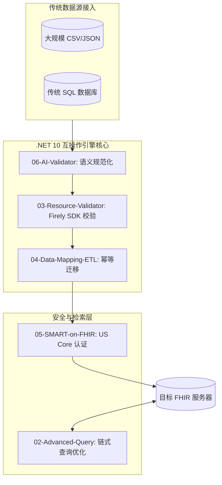

# AI 驱动的 FHIR 医疗数据互操作引擎 .NET 10

### *赋能 2026 年医疗数据生态：高性能 .NET 10 + 本地化私有 AI*

[](https://dotnet.microsoft.com/)
[](https://hl7.org/fhir/R4/)
[](#)
[]()
[](./src/tests/)

[🌐 **文档与 API 参考：访问 GitHub Pages**](https://memoryfraction.github.io/HealthData-Interoperability-Csharp)

---

## 📌 项目定位与行业背景

在 2026 年的医疗行业，数据互操作已从"可选功能"变为联邦法规强制要求。**《21世纪治愈法案》(21st Century Cures Act)** 明确要求医疗机构实现标准化数据交换。本项目是一个**生产级医疗数据互操作引擎**，专门解决碎片化传统临床数据向 **HL7 FHIR R4/R5** 标准迁移的难题。

> 中文版说明：本项目基于美国医疗标准（FHIR US Core / HIPAA）构建，但核心架构和模式可迁移至中国市场——中国正在推进 FHIR China IG 标准化进程。



### 🛡️ 核心价值主张

* **AI 辅助数据规范化**：利用本地部署的大语言模型（不上传 PHI），解决传统 ETL 无法处理的"模糊数据"问题。
* **合规优先架构**：严格遵循 **US Core Implementation Guide** 和 **ONC (g)(10)** 要求设计，满足联邦互操作标准。
* **企业级 .NET 10 技术栈**：展示对 **Interceptors**、**JSON Source Generation**、**Native AOT** 等前沿技术的掌握，适用于边缘医疗设备部署。

---

## 📂 系统架构与模块说明

| 模块 | 技术重点 | 业务价值 | 状态 |
| :--- | :--- | :--- | :--- |
| **[07-HIPAA-Compliance-Demo](./src/07-HIPAA-Compliance-Demo)** | **HIPAA 合规框架** | **最小权限原则**：8 角色 RBAC + 患者授权验证 + 不可篡改审计日志 | ✅ **技术展示项目** |
| **[06-AI-Data-Validator](./src/06-AI-Data-Validator)** | **AI 语义 ETL** | **数据清洗**：本地 LLM 规范化"噪声"数据，零 PHI 泄漏 | ✅ **技术展示项目** |
| **[05-SMART-on-FHIR](./src/05-SMART-on-FHIR)** | **联邦合规认证** | **(g)(10) 就绪**：OAuth2/OIDC 认证 + US Core 患者资料 | ✅ **技术展示项目** |
| **[04-Data-Mapping-ETL](./src/04-Data-Mapping-ETL)** | **传统系统集成** | **数据完整性**：幂等写入，高并发迁移防重复 | ✅ **技术展示项目** |
| **[03-Resource-Validator](./src/03-Resource-Validator)** | **风险管理** | **临床防火墙**：Firely SDK 校验 + US Core 标准符合性检查 | ✅ **技术展示项目** |
| **[02-Advanced-Query](./src/02-Advanced-Query)** | **搜索优化** | **性能提升**：链式参数 + `_include` 减少网络往返次数 | ✅ **技术展示项目** |

---

## 🚀 技术深度解析：应对 2026 年医疗 IT 挑战

### 🧩 模块 07：HIPAA 合规框架演示

随着数据互操作成为联邦法规要求，确保 HIPAA 合规是保护受保护健康信息（PHI）的底线。本模块展示了生产级合规框架，结合基于角色的访问控制（RBAC）和患者授权验证，满足 HIPAA 最小必要原则和 ONC (g)(10) 要求。

#### 🔴 合规痛点分析
* **过度宽松的访问权限**：通用认证系统往往授予过宽的 PHI 访问权，违反最小权限原则
* **审计追踪缺失**：PHI 访问/拒绝操作的日志不完整，导致合规审计困难
* **授权管理混乱**：未验证患者同意即使用 PHI，引发监管违规和信任危机
* **PHI 暴露失控**：缺少字段级脱敏，敏感数据（社保号、病史）可能泄露

#### 🟢 本模块的解决方案
```
RBAC 引擎 (8 角色) → 权限矩阵验证 → 审计日志记录 → 不可篡改存储
         ↓
患者授权检查 → 同意状态验证 → 最小必要过滤 → PHI 安全访问
```

**关键技术实现：**
- **8 角色 RBAC 矩阵**：覆盖医师、护士、管理员、研究员、医保审核员、患者、系统审计员、数据管家
- **不可篡改审计日志**：SHA-256 链式哈希，每个记录与前一条链接
- **患者授权验证器**：细粒度同意管理（治疗/支付/运营分别控制）

### 🧩 模块 06：AI 驱动的数据质量验证

医疗数据清洗是互操作工程的核心挑战。本模块使用本地部署的 LLM（Ollama），在不将 PHI 上传到云端的条件下，对"噪声"临床数据进行语义规范化。

#### 🔴 数据质量问题
- **拼写与缩写不一致**：不同医疗机构用词差异大
- **编码映射缺失**：SNOMED CT / LOINC 等标准编码无法自动映射
- **数据类型混用**：自由文本、结构化数据混合存储
- **缺失值与冗余数据并存**

#### 🟢 AI 辅助解决方案
```
脏数据输入 → Ollama (本地 LLM) → 语义规范化 → FHIR 标准化输出
                    ↑
           PHI 脱敏保护（不出本地）
```

### 🧩 模块 05：SMART on FHIR 认证集成

本模块演示了如何通过 SMART on FHIR 协议实现 EHR 系统的合规数据访问，包括 OAuth2/OIDC 身份验证和 US Core 患者资料支持。

#### 🔴 认证接入挑战
- **EHR 厂商碎片化**：不同系统使用不同的认证机制
- **作用域管理复杂**：需要精细化控制数据访问权限
- **令牌生命周期管理**：刷新、撤销、轮换策略需精心设计

#### 🟢 标准化解决方案
```
OAuth2 授权码流程 → OIDC 身份验证 → 令牌管理 → US Core 数据检索
                      ↓
              作用域最小化（只请求必要权限）
```

### 🧩 模块 04：数据映射 ETL 管道

将传统 CSV/JSON/SQL 数据迁移到 FHIR 标准格式，需要保证数据的完整性、幂等性和高性能。本模块展示了完整的数据迁移流水线。

#### 🔴 ETL 挑战
- **数据映射复杂**：源格式与 FHIR R4 资源结构差异大
- **重复数据风险**：高并发场景下容易出现资源重复创建
- **数据类型转换**：性别、地址、联系方式等需要规范化处理

#### 🟢 本模块方案
```
提取 (CSV/JSON) → 映射 (FHIR Patient/Observation) → 幂等写入 (Conditional PUT)
                           ↓
                   Mapperly 编译时代码生成
```

### 🧩 模块 03：FHIR 资源验证器

使用 Firely SDK 对 FHIR 资源进行全面验证，包括结构校验和 US Core 标准符合性检查。

#### 🔴 验证必要性
- **FHIR 规范庞大**：数千页的文档，手动验证不现实
- **互操作依赖标准**：不符合标准的资源会导致系统间交换失败
- **合规要求严格**：US Core 是联邦法规强制要求

### 🧩 模块 02：高级查询优化

通过链式参数（Chained Parameters）和 `_include`/`_revinclude` 优化 FHIR 搜索性能。

#### 🔴 查询性能问题
- **多次往返请求**：传统方式需要多次 API 调用获取关联数据
- **大数据集分页**：海量资源的分页处理影响用户体验
- **复杂过滤条件**：多条件组合搜索效率低

---

## 📦 HealthDataInteropSharedLibrary 共享库

本库是项目的核心可复用组件，所有演示模块都引用它。设计目标是：**让其他人直接通过 NuGet 引用即可获得生产级医疗数据互操作能力**。

> 医疗数据互操作是现代软件工程中最具挑战性的问题之一。本库解决了以下真实痛点：

| 问题 | 解决方案 |
|---------|----------|
| **FHIR 规范数千页文档** | 封装了 Patient CRUD、搜索和验证服务，开箱即用 |
| **HIPAA 合规编码需谨慎** | 内置 RBAC、PHI 脱敏（日志前）、不可篡改审计追踪、加密工具 |
| **ONC 认证需符合 US Core** | 资源提交生产环境前自动校验联邦标准 |
| **传统 CSV/SQL 到 FHIR 迁移繁琐** | ETL 流水线自动化映射、性别规范化、幂等更新（Mapperly 编译时生成） |
| **杂乱临床数据无法通过传统验证** | 本地 AI（Ollama）规范化模糊文本，PHI 不出本地网络 |
| **公共 FHIR 服务器连接不稳定** | 每个模块都有优雅降级：网络异常、规范下载失败、资源重复均能处理 |

*本库是生产级医疗互操作模式的参考实现和教育资源——详见下方 License 条款。*

---

## 📦 NuGet 包

**包 ID**: `HealthData.Interop.Fhir`  
**版本**: [](https://www.nuget.org/packages/HealthData.Interop.Fhir/)  
**许可证**: MIT | **作者**: Rong(Rex) Fan

生产级 .NET 8 医疗数据互操作库，功能包括：
- 🔷 **FHIR R4 客户端工具** - 资源搜索、检索、创建
- 🛡️ **HIPAA 合规辅助** - RBAC、PHI 加密、不可篡改审计日志
- ⚖️ **US Core 标准校验器** - 验证资源是否符合联邦标准
- 🤖 **AI 数据验证** - 本地 LLM 驱动的语义规范化（Ollama）
- 🔄 **ETL 流水线** - CSV/JSON 到 FHIR 迁移，支持幂等写入
- 🔐 **SMART on FHIR 认证** - EHR 系统 OAuth2/OIDC 接入

### 安装

```bash
# 方式一：.NET CLI
dotnet add package HealthData.Interop.Fhir

# 方式二：Package Manager Console
Install-Package HealthData.Interop.Fhir
```

### 快速开始

```csharp
using HealthDataInteropSharedLibrary.BasicClient;
using HealthDataInteropSharedLibrary.ResourceValidator;

// 1. 初始化 FHIR 客户端服务
var fhirService = new FhirBasicService("https://your-fhir-server.com");

// 2. 按姓名搜索患者
var patients = await fhirService.SearchPatientsByNameAsync("John");

// 3. 验证资源是否符合 US Core 标准
var validator = new ResourceValidationService();
bool isValid = validator.Validate(patients.First());

// 4. HIPAA 合规检查（访问 PHI 前）
using HealthDataInteropSharedLibrary.Compliance;
var accessResult = HipaaComplianceOrchestrator.EvaluateAccess(
    role: FhirUserRole.Physician,
    action: "ReadPatient",
    patientId: "123");

if (accessResult.IsAllowed) {
    Console.WriteLine("✓ PHI 访问已授权，审计日志已记录");
}
```

---

## 📖 快速开始

1. **环境准备**
   - 安装 **.NET 8 SDK 或更高版本**（共享库基于 .NET 8 LTS；演示应用运行在 .NET 10）
   - （模块 06 可选）安装 [Ollama](https://ollama.com/) 并运行 `ollama run llama3`

2. **FHIR 规范验证说明**
   - 模块 03（资源验证器）使用 Firely SDK，首次运行时会下载 FHIR R4 规范文件（约 40MB）
   - 若网络不可用，自动降级为基本结构校验
   - NuGet 用户在离线环境下也能优雅降级

3. **运行测试**
```bash
dotnet test
```

---

## ⚠️ 安全声明

**TLS 证书验证状态：**
- 模块 05（SMART on FHIR）在开发环境中**绕过了 HTTPS 证书验证**（因网络环境问题）
- **这是仅限开发的临时方案**，会引入中间人攻击风险，违反 HIPAA §164.312(e)(1) 传输安全规定
- **生产部署必须执行以下操作：**
  1. 移除 `RemoteCertificateValidationCallback = ... => true`
  2. 所有 FHIR 客户端端点**强制 HTTPS 连接**（不允许 HTTP 降级）
  3. 配置服务器端 HSTS 头部
  4. 最低 TLS 1.2+

详见 `src/05-SMART-on-FHIR/Program.cs` 中的内联警告。

---

## 🌏 中美医疗数据标准对照（开发者参考）

本库基于美国标准构建，但核心架构可迁移至中国市场：

| 维度 | 🇺🇸 美国体系 | 🇨🇳 中国体系 |
|------|-------------|-------------|
| **互操作标准** | HL7 FHIR R4/R5 (主导) | HL7 FHIR（推进中），WS/T 系列规范 |
| **安全合规** | HIPAA Privacy & Security Rules | 《个人信息保护法》PIPL、等保2.0三级 |
| **编码体系** | ICD-10-CM, SNOMED CT, LOINC | ICD-10/11, 国家临床版3.0 |
| **互操作认证** | ONC (g)(10), US Core IG | 互联互通成熟度测评（四甲） |

> 中国市场适用场景：本库中的 ETL 管道、AI 数据验证、资源校验等模块可复用于 FHIR China IG 项目。安全合规模块需按 PIPL/等保2.0 重新适配。

---

## 👤 联系与合作

**Rong(Rex) Fan** - 10+ 年 .NET/C# 经验 | AI 与医疗数据互操作（FHIR/HL7）
* **LinkedIn**: [Rex Linkedin](https://www.linkedin.com/in/rongfan1031/)
* **Medium 专栏**: [rex.fan18@medium.com](https://medium.com/@rex.fan18)
* **咨询预约**: [Schedule a 30-min Call](https://calendly.com/rex-fan18/30min)
* **专注方向**：构建高性能、合规的医疗信息系统 | 美国无赞助需求

---

## ⚖️ License

MIT License — 详见 [LICENSE](./LICENSE) 文件。

> **免责声明**：本项目按"现状"提供，不提供任何形式的质保或维护承诺。使用者需自行评估其生产环境的适用性并独立承担相关风险。作者不对因使用本代码而导致的任何直接或间接损失负责。

This project is provided as-is without warranty, maintenance, or support. Use at your own risk.
