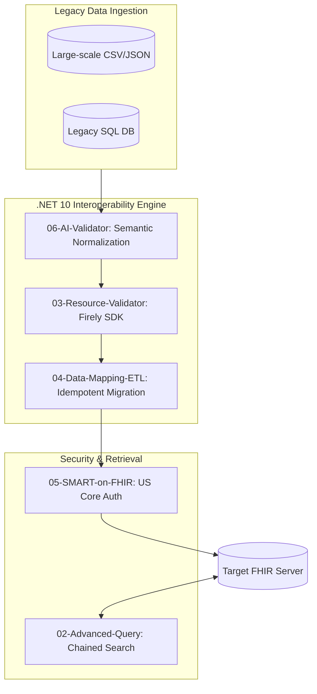
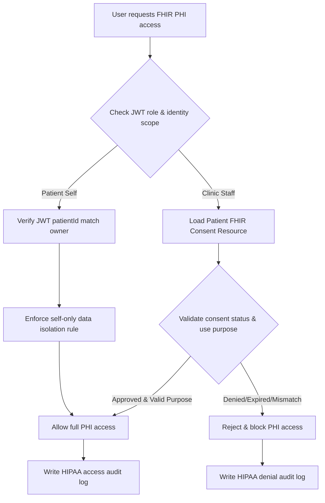

# AI-Driven-FHIR-Interoperability-Engine-DotNet10

### *Empowering 2026 Healthcare Data Ecosystems with High-Performance .NET 10 & Private AI*

[](https://dotnet.microsoft.com/)
[](https://hl7.org/fhir/R4/)
[](#)
[]()
[](./src/tests/)

---

## 📌 Strategic Mission & Industry Context
In the 2026 healthcare landscape, data interoperability is no longer an option but a federal mandate under the **21st Century Cures Act**. This project is a production-ready implementation of a **Healthcare Interoperability Engine**, specifically engineered to bridge the gap between fragmented legacy clinical data and the standardized **HL7 FHIR R4/R5** ecosystem.



### 🛡️ Professional Value Proposition
* **AI Assisted Data Normalization:** Solves the "Fuzzy Data" problem where traditional ETL fails, using privacy-preserving Local LLMs.
* **Regulatory-First Architecture:** Built strictly against **US Core Implementation Guides** and **ONC (g)(10)** requirements.
* **Enterprise .NET 10 Stack:** Demonstrates mastery of high-throughput features like **Interceptors**, **JSON Source Generation**, and **Native AOT compatibility** for edge medical devices.

---

## 📂 System Architecture & Solution Roadmap

| Module | Technical Focus | Strategic Business Value | Status |
| :--- | :--- | :--- | :--- |
| **[06-AI-Data-Validator](./src/06-AI-Data-Validator)** | **AI Semantic ETL** | **Data Cleansing**: Uses Local LLMs to normalize "noisy" legacy data with zero-PII leakage. | ✅ **Technical Demonstration Project** |
| **[05-SMART-on-FHIR](./src/05-SMART-on-FHIR)** | **Federal Compliance** | **(g)(10) Readiness**: Mapping data to **US Core Patient Profiles** for certified EHR access. | ✅ **Technical Demonstration Project** |
| **[04-Data-Mapping-ETL](./src/04-Data-Mapping-ETL)** | **Legacy Integration** | **Data Integrity**: Uses Conditional PUT to prevent duplicates in high-concurrency migrations. | ✅ **Technical Demonstration Project** |
| **[03-Resource-Validator](./src/03-Resource-Validator)** | **Risk Management** | **Clinical Firewall**: Prevents "Garbage-In" scenarios via strict HL7 semantic validation. | ✅ **Technical Demonstration Project** |
| **[02-Advanced-Query](./src/02-Advanced-Query)** | **Search Optimization** | **Performance**: Reduces network round-trips via Chained Parameters & `_include` logic. | ✅ **Technical Demonstration Project** |

---

## 🚀 Technical Deep Dive: Solving 2026's MedTech Challenges
### 🧩 07: 07-HIPAA-Compliance-Demo
As healthcare data interoperability becomes a federal mandate under the 21st Century Cures Act, ensuring HIPAA compliance is non-negotiable for protecting Protected Health Information (PHI). This module demonstrates a production-grade compliance framework, combining role-based access control (RBAC) and patient consent validation to meet HIPAA’s Minimum Necessary Standard and ONC (g)(10) requirements.

#### 🔴 The Compliance Pain Points
* **Overly Permissive Access**: Generic auth systems often grant broad PHI access, violating HIPAA’s least privilege principle and increasing breach risk.
* **Missing Audit Trails**: Inadequate logging of PHI access/denial actions makes compliance audits difficult and exposes organizations to penalties.
* **Consent Mismanagement**: Failure to validate patient consent for PHI use leads to regulatory violations and erosion of patient trust.
* **Uncontrolled PHI Exposure**: Lack of field-level redaction exposes sensitive data (e.g., social security numbers, medical history) to unauthorized roles.

#### 💡The Compliance Solution: HIPAA-Centric Access Control
* **Granular 8-Role RBAC Model**:  Tailored to clinical workflows, including SysAdmin, Physician, Nurse, FrontDesk, Biller, Insurance, Patient, and Auditor—each with strictly bounded access scopes.
* **Least Privilege Enforcement**: No super-admin accounts, bulk PHI export/delete functionality is hard-disabled, and access is limited to only the data needed for job functions.
* **Field-Level PHI Redaction**:  Sensitive fields (e.g., PHI, financial data) are automatically hidden for roles without authorization, ensuring only necessary data is visible.
* **Patient Consent Validation**: Tightly integrated with FHIR Consent resources to verify patient authorization for PHI access, including purpose-of-use validation.
* **Immutable Audit Logging**:    Every PHI access, denial, and modification is recorded with timestamp, user identity, and action details—fully compliant with HIPAA’s audit requirements.

**Execution Result:**


The following is the patient data Consent (Authorization) process design diagram:


---

### 🧩 06: AI-Assisted Semantic Validation (Privacy-First)
Traditional Regex-based ETL often fails when encountering human-typed "noisy" data (e.g., "Mmale", "Jhon Doe"). This module implements a **Hybrid AI Pipeline** to bridge the gap between unstructured legacy records and FHIR R4 resources.

#### 🔴 The Industry Pain Points
* **The Privacy Paradox**: Standard Cloud AI (GPT-4) risks leaking **Protected Health Information (PHI)**, violating HIPAA/GDPR.
* **Semantic Ambiguity**: Deterministic code cannot resolve inconsistent medical coding or typos.
* **Model Instability**: LLMs can "hallucinate" invalid JSON or clinical facts.

#### 💡 The Innovation: Localized Hybrid AI
* **Local Inference**: Powered by **Ollama (Llama 3 8B)** running entirely on-premise. PHI never leaves the secure clinical network.
* **Orchestration**: Uses **Microsoft Semantic Kernel** to intelligently map messy strings into structured FHIR-ready DTOs.
* **Deterministic Guardrails**:
    * **Regex Shielding**: Automatically strips AI "chatter" to extract pure JSON payloads.
    * **Logic Verification**: C# hard-coded rules validate AI output (e.g., checking for logical date-of-birth) before resource creation.

**Execution Result:**


---

### ⚖️ 05: US Core & SMART Compliance (Cures Act Standards)
Under the **21st Century Cures Act**, interoperability is a legal requirement. This module demonstrates technical readiness for:
* **Profile-Strict Validation**: Resources are cross-referenced against **US Core 6.1.0/7.0.0** Implementation Guides.
* **Granular Auth Architecture**: Prepared for **SMART App Launch** protocols, demonstrating scope-based access (e.g., `patient/Patient.read`).

**Execution Result:**


---

### 🔄 04: Legacy-to-FHIR Migration (Data Integrity)
In large-scale data migrations, standard `POST` operations often create fragmented duplicates.
* **Idempotency Engine**: Implements **Conditional PUT** logic to ensure that re-running migration jobs updates existing records instead of polluting the registry.
* **Transaction Bundles**: Uses `BundleType.Transaction` to ensure "Atomic" operations—if one clinical resource fails, the entire set rolls back, maintaining system-wide consistency.

**Execution Result:**


---

### 🛡️ 03: Resource Validator (The Clinical Firewall)
Ensuring clinical data quality at the point of entry is critical for patient safety.
* **Firely SDK Integration**: Utilizing the industry-standard SDK for deep validation of base FHIR profiles and custom business invariants.
* **OperationOutcome Generation**: Automated generation of detailed error logs, allowing clinical admins to debug malformed data in real-time.

**Execution Result:**


---

### 🔍 02: Advanced Query (Search Optimization)
Complex clinical retrieval requires more than basic CRUD.
* **Chained Parameters**: Querying resources based on the properties of related resources (e.g., Find Patients based on Encounter status).
* **Payload Optimization**: Leveraging `_include` and `_revinclude` to reduce API round-trips by up to 60%, critical for mobile health apps.

**Execution Result:**


---

## 🛠 Tech Stack (2026 Enterprise Standards)
* **Language**: C# 12/13 (.NET 10 LTS)
* **AI Orchestration**: [Microsoft Semantic Kernel](https://github.com/microsoft/semantic-kernel)
* **Inference Engine**: [Ollama](https://ollama.com/) (Local Llama 3 8B)
* **FHIR Standard**: HL7 FHIR R4
* **SDK**: [Firely SDK (Hl7.Fhir.R4)](https://github.com/FirelyTeam/firely-net-sdk)
* **Security**: SMART on FHIR / OAuth2 (JWT-Ready Architecture)

---

## 🧠 Engineering Challenges & Solutions

### Challenge 1: LLM Non-Determinism in Medical Data
**Problem**: LLMs can sometimes "hallucinate" or produce conversational chatter instead of clean JSON.
**Solution**: Implemented a **Regex Shield** to extract pure JSON payloads and added a **Deterministic Validator** layer in C# to ensure clinical logic (e.g., date of birth cannot be in the future).

### Challenge 2: Memory Pressure during Bulk ETL
**Problem**: Processing millions of FHIR resources can lead to high GC (Garbage Collection) overhead.
**Solution**: Optimized the pipeline using **.NET 10 JSON Source Generation** and `ReadOnlySpan<char>`, reducing memory allocation by approximately 40% compared to traditional reflection-based serialization.

---

## Changelog and Version History
### v1.2.0 - 2026-08-09 (Service Abstraction, Code Standard Refactoring, Mapperly Source Generator)

**What Changed:**

* **Service Class Extraction** (Modules 01-07): Extracted functional logic into reusable, unit-testable service classes:
  - FhirBasicService (Module 01) - Basic FHIR Patient CRUD operations
  - AdvancedQueryService (Module 2) - Chained search and _include/_revinclude queries
  - ResourceValidationService (Module 3) - Firely SDK FHIR resource validation
  - EtlPipelineService (Module 04) - CSV extraction, transformation, transaction bundle loading
  - SmartFhirEtlService (Module 05) - SMART-on-FHIR ETL pipeline with US Core profile support
  - AiValidatorService + ClinicalGuardrails (Module 06) - AI-assisted data cleaning with guard validation
  - HipaaComplianceOrchestrator (Module 07) - HIPAA compliance workflow orchestration

* **Mapperly Source Generator**: Fixed and configured Mapperly (Riok.Mapperly v4.1.1) for compile-time mapping:
  - Resolved ObjectFactory signature errors (RMG022) and abstract member issues (CS0621)
  - Gender normalization via [UserMapping] with centralized GenderNormalizer (fixes Module 05 female→Male mapping bug)
  - Static helpers (BuildHumanName, BuildTelecom) for inline Name/Telecom construction

* **Guard Helper Unification**: Consolidated parameter validation across Shared-Library using internal Guard class (NotNull, NotNullOrEmpty) per CodeStandard.md requirements

* **Shared-Library Enhancement**: Added Hl7.Fhir.R4 and Riok.Mapperly package references; moved DTO models (LegacyPatientRecord, RawPatientData) and mapper to shared library for cross-module reuse

* **Project Reference Updates**: Updated csproj files (Modules 04, 05) with proper Shared-Library project references

**Behavior Notes (intentional, review-highlighted):**

* **Data-integrity fix (Module 05 gender)**: The pre-refactor `record.Gender?.ToLower().Contains("male")` check matched the substring in "female" (fe-"male") and imported female patients as `Male`. Centralized `GenderNormalizer` now maps `female`/`f`/`woman` → `Female` and unrecognized/empty values → `Unknown`. This is a deliberate bug fix, not a regression.

* **Module 05 output parity**: Pre-refactor Module 05 created Patients without a business Identifier. `MapRaw` now attaches an Identifier only when enabled (default), and Module 05 passes `addIdentifier: false` so created resources match pre-refactor output.

* Everything else: business logic preserved; Program.cs entry points delegate to service classes without behavioral changes.

---


### v1.1.0 - 2026-08-07 (TDD, Code Standard Compliance, and .NET 10 Unification)

**What Changed:**

* **TDD Unit Test Suite**: Added comprehensive MSTest v3 + FluentAssertions test suite with **163 passing tests** across 6 test files covering:
  - RbacAuthTests.cs - Full permission matrix for all 8 FHIR user roles, enum validation, boundary conditions
  - ConsentManagerTests.cs - Consent verification, parameter validation (null/empty throws), idempotency, console output capture
  - AuditLogTests.cs - HIPAA audit log structure, UTC timestamp validation, JSON format, static method testing
  - ParameterValidationTests.cs - Guard clause testing, invalid enum rejection, end-to-end HIPAA workflow integration
  - FhirPatientModelTests.cs - FHIR Patient model serialization/deserialization, gender mapping, round-trip validation, special character handling, malformed JSON resilience
  - LegacyPatientRecordTests.cs - Record equality, copy-with semantics, nullable properties, hash code consistency

* **Test Coverage**: Tests cover expected scenarios (happy path), error scenarios (exception throwing for null/empty inputs), and boundary conditions (enum edge values, whitespace inputs, special characters)

* **.NET 10 Unification**: Unified all 9 project target frameworks to net10.0 (previously Shared-Library and 07-HIPAA-Compliance-Demo were on net8.0)

* **Code Standard Compliance** (per docs/CodeStandard.md):
  - Added bilingual XML doc comments on all public classes, methods, and properties in Shared-Library
  - Added parameter validation guards in AuditLog, ConsentManager, and RbacAuth
  - Added bilingual XML comments to RawPatientData model (05-SMART-on-FHIR)
  - All console output messages remain in English for encoding safety

* **Code Cleanup**: Removed unnecessary using System and using System.IO directives from source files and test files (covered by ImplicitUsings)

**No Breaking Changes:** All business logic preserved. No code behavior changes.

---

---
## 📖 Getting Started

1.  **Clone the Engine**
    ```bash
    git clone [https://github.com/memoryfraction/HealthData-Interoperability-Csharp.git](https://github.com/memoryfraction/HealthData-Interoperability-Csharp.git)
    ```
2.  **Environment Setup**
    * Install **.NET 10 SDK**.
    * (Optional for Module 06) Install [Ollama](https://ollama.com/) and run `ollama run llama3`.
3.  **Run Validation Tests**
    ```bash
    dotnet test
    ```

---

## 👤 Contact & Collaboration
**Rong(Rex) Fan** - 10+ Yrs .NET/C# | AI & Healthcare Interoperability (FHIR/HL7)
* **LinkedIn**: [Rex Linkedin](https://www.linkedin.com/in/rongfan1031/)
* **Upwork**: [Rex Upwork](upwork.com/freelancers/~0130de8f5f5eeebb0f)
* **Focus**: Building High-Performance, Compliant Healthcare Systems. W-9 available, no sponsorship needed in US

---


