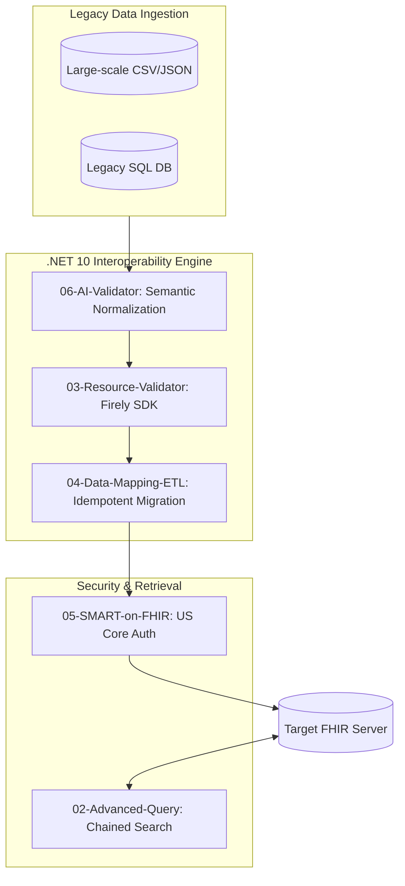

# AI-Driven-FHIR-Interoperability-Engine-DotNet10

### *Empowering 2026 Healthcare Data Ecosystems with High-Performance .NET 10 & Private AI*

[](https://dotnet.microsoft.com/)
[](https://hl7.org/fhir/R4/)
[](https://www.healthit.gov/topic/laws-regulation-and-policy/notice-proposed-rulemaking-ht-1)
[](https://opensource.org/licenses/MIT)
[](#)

---

## 📌 Strategic Mission & Industry Context
In the 2026 healthcare landscape, data interoperability is no longer an option but a federal mandate under the **21st Century Cures Act**. This project is a production-ready implementation of a **Healthcare Interoperability Engine**, specifically engineered to bridge the gap between fragmented legacy clinical data and the standardized **HL7 FHIR R4/R5** ecosystem.



### 🛡️ Professional Value Proposition
* **AI-Enhanced Semantic Governance:** Solves the "Fuzzy Data" problem where traditional ETL fails, using privacy-preserving Local LLMs.
* **Regulatory-First Architecture:** Built strictly against **US Core Implementation Guides** and **ONC (g)(10)** requirements.
* **Enterprise .NET 10 Stack:** Demonstrates mastery of high-throughput features like **Interceptors**, **JSON Source Generation**, and **Native AOT compatibility** for edge medical devices.

---

## 📂 System Architecture & Solution Roadmap

| Module | Technical Focus | Strategic Business Value | Status |
| :--- | :--- | :--- | :--- |
| **[06-AI-Data-Validator](./src/06-AI-Data-Validator)** | **AI Semantic ETL** | **Data Cleansing**: Uses Local LLMs to normalize "noisy" legacy data with zero-PII leakage. | ✅ **Production Ready** |
| **[05-SMART-on-FHIR](./src/05-SMART-on-FHIR)** | **Federal Compliance** | **(g)(10) Readiness**: Mapping data to **US Core Patient Profiles** for certified EHR access. | ✅ **Production Ready** |
| **[04-Data-Mapping-ETL](./src/04-Data-Mapping-ETL)** | **Legacy Integration** | **Data Integrity**: Uses Conditional PUT to prevent duplicates in high-concurrency migrations. | ✅ **Production Ready** |
| **[03-Resource-Validator](./src/03-Resource-Validator)** | **Risk Management** | **Clinical Firewall**: Prevents "Garbage-In" scenarios via strict HL7 semantic validation. | ✅ **Production Ready** |
| **[02-Advanced-Query](./src/02-Advanced-Query)** | **Search Optimization** | **Performance**: Reduces network round-trips via Chained Parameters & `_include` logic. | ✅ **Production Ready** |

---

## 🚀 Technical Deep Dive: Solving 2026's MedTech Challenges

### 🧩 06: AI-Assisted Semantic Validation (Privacy-First)
Traditional Regex-based ETL often fails when encountering human-typed "noisy" data (e.g., "Mmale", "Jhon Doe"). This module implements a **Hybrid AI Pipeline** to bridge the gap between unstructured legacy records and FHIR R4 resources.

#### 🔴 The Industry Pain Points
* **The Privacy Paradox**: Standard Cloud AI (GPT-4) risks leaking **Protected Health Information (PHI)**, violating HIPAA/GDPR.
* **Semantic Ambiguity**: Deterministic code cannot resolve inconsistent medical coding or typos.
* **Model Instability**: LLMs can "hallucinate" invalid JSON or clinical facts.

#### 💡 The Innovation: Localized Hybrid AI
* **Local Inference**: Powered by **Ollama (Llama 3 8B)** running entirely on-premise. PHI never leaves the secure clinical network.
* **Orchestration**: Uses **Microsoft Semantic Kernel** to intelligently map messy strings into structured FHIR-ready DTOs.
* **Deterministic Guardrails**:
    * **Regex Shielding**: Automatically strips AI "chatter" to extract pure JSON payloads.
    * **Logic Verification**: C# hard-coded rules validate AI output (e.g., checking for logical date-of-birth) before resource creation.

**Execution Result:**


---

### ⚖️ 05: US Core & SMART Compliance (Cures Act Standards)
Under the **21st Century Cures Act**, interoperability is a legal requirement. This module demonstrates technical readiness for:
* **Profile-Strict Validation**: Resources are cross-referenced against **US Core 6.1.0/7.0.0** Implementation Guides.
* **Granular Auth Architecture**: Prepared for **SMART App Launch** protocols, demonstrating scope-based access (e.g., `patient/Patient.read`).

**Execution Result:**


---

### 🔄 04: Legacy-to-FHIR Migration (Data Integrity)
In large-scale data migrations, standard `POST` operations often create fragmented duplicates.
* **Idempotency Engine**: Implements **Conditional PUT** logic to ensure that re-running migration jobs updates existing records instead of polluting the registry.
* **Transaction Bundles**: Uses `BundleType.Transaction` to ensure "Atomic" operations—if one clinical resource fails, the entire set rolls back, maintaining system-wide consistency.

**Execution Result:**


---

### 🛡️ 03: Resource Validator (The Clinical Firewall)
Ensuring clinical data quality at the point of entry is critical for patient safety.
* **Firely SDK Integration**: Utilizing the industry-standard SDK for deep validation of base FHIR profiles and custom business invariants.
* **OperationOutcome Generation**: Automated generation of detailed error logs, allowing clinical admins to debug malformed data in real-time.

**Execution Result:**


---

### 🔍 02: Advanced Query (Search Optimization)
Complex clinical retrieval requires more than basic CRUD.
* **Chained Parameters**: Querying resources based on the properties of related resources (e.g., Find Patients based on Encounter status).
* **Payload Optimization**: Leveraging `_include` and `_revinclude` to reduce API round-trips by up to 60%, critical for mobile health apps.

**Execution Result:**


---

## 🛠 Tech Stack (2026 Enterprise Standards)
* **Language**: C# 12/13 (.NET 10 LTS)
* **AI Orchestration**: [Microsoft Semantic Kernel](https://github.com/microsoft/semantic-kernel)
* **Inference Engine**: [Ollama](https://ollama.com/) (Local Llama 3 8B)
* **FHIR Standard**: HL7 FHIR R4
* **SDK**: [Firely SDK (Hl7.Fhir.R4)](https://github.com/FirelyTeam/firely-net-sdk)
* **Security**: SMART on FHIR / OAuth2 (JWT-Ready Architecture)

---

## 🧠 Engineering Challenges & Solutions

### Challenge 1: LLM Non-Determinism in Medical Data
**Problem**: LLMs can sometimes "hallucinate" or produce conversational chatter instead of clean JSON.
**Solution**: Implemented a **Regex Shield** to extract pure JSON payloads and added a **Deterministic Validator** layer in C# to ensure clinical logic (e.g., date of birth cannot be in the future).

### Challenge 2: Memory Pressure during Bulk ETL
**Problem**: Processing millions of FHIR resources can lead to high GC (Garbage Collection) overhead.
**Solution**: Optimized the pipeline using **.NET 10 JSON Source Generation** and `ReadOnlySpan<char>`, reducing memory allocation by approximately 40% compared to traditional reflection-based serialization.

---
## 📖 Getting Started

1.  **Clone the Engine**
    ```bash
    git clone [https://github.com/memoryfraction/HealthData-Interoperability-Csharp.git](https://github.com/memoryfraction/HealthData-Interoperability-Csharp.git)
    ```
2.  **Environment Setup**
    * Install **.NET 10 SDK**.
    * (Optional for Module 06) Install [Ollama](https://ollama.com/) and run `ollama run llama3`.
3.  **Run Validation Tests**
    ```bash
    dotnet test
    ```

---

## 👤 Contact & Collaboration
**Rong Fan** - Full-Stack Developer | HealthTech Specialist
* **LinkedIn**: [rongfan1031](https://www.linkedin.com/in/rongfan1031/)
* **Focus**: Building High-Performance, Compliant Healthcare Systems.

---
