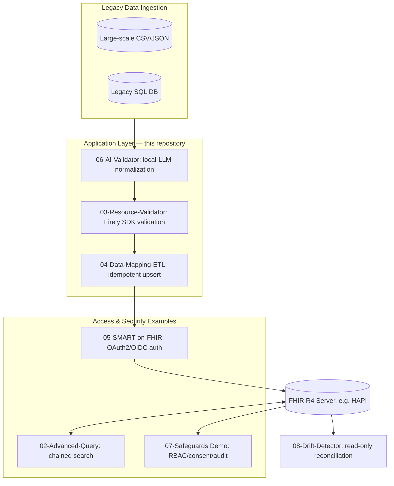
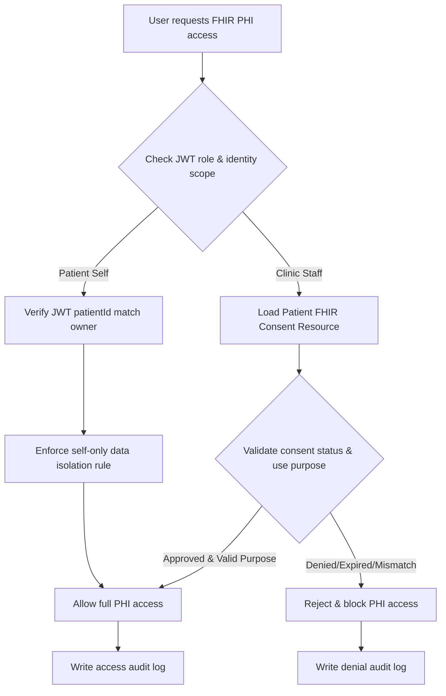

# HealthData Interoperability for .NET

**A runnable reference implementation for HL7 FHIR R4 interoperability on .NET, built on the Firely .NET SDK — with a set of working examples you can read, run, and adapt.**

[](https://dotnet.microsoft.com/)
[](https://hl7.org/fhir/R4/)
[](https://www.nuget.org/packages/HealthData.Interop.Fhir/1.4.2)
[](./src/tests/)
[](./LICENSE)

[🌐 **Documentation & API Reference: Visit GitHub Pages**](https://memoryfraction.github.io/HealthData-Interoperability-Csharp)

## 📌 What this project is (and is not)

**What it is:** An application-layer toolkit and reference implementation for HL7 FHIR R4 interoperability on .NET. It builds on the [Firely .NET SDK](https://github.com/FirelyTeam/firely-net-sdk) — [Hl7.Fhir.R4](https://www.nuget.org/packages/Hl7.Fhir.R4/) (FHIR client/model) and [Firely.Fhir.Validation.R4](https://www.nuget.org/packages/Firely.Fhir.Validation.R4/) (resource validation) — and adds small, testable services on top: patient CRUD, advanced search, FHIR resource validation, CSV→FHIR ETL, SMART on FHIR auth, AI-assisted data mapping (local LLM), HIPAA-oriented security examples (RBAC, consent, audit, PHI masking), and data drift detection.

**What it is not:** It does not replace a FHIR server, it is not a full EHR, and it is not a FHIR server "engine" or middleware platform. It does not by itself provide certified HIPAA or ONC compliance. Treat it as a starting point and a collection of patterns, not a turnkey or certified product.

**Where this fits architecturally:** this toolkit's modules assemble the components a *hybrid* FHIR architecture needs around a FHIR server (data mapping/ETL in module 04, drift detection in module 08, validation in module 03, auth in module 05, RBAC/consent/audit in module 07) — the FHIR server holds the copy, and the legacy/CSV source stays the system of record. It is not a facade (no dynamic per-request translation) and not FHIR-native (nothing here claims the FHIR server as source of truth). If your project needs a different model, treat these modules as a reference for what to build, not a drop-in fit.

**Stability:** Current version **v1.4.2**. The project is **early-stage**; the public API may still change between minor versions. Use `HealthData.Interop.Fhir` in non-critical or proof-of-concept work until it reaches a stable 2.x line.

### Architecture overview



## 📌 What this project demonstrates

A set of working, runnable examples of interoperability patterns related to **US Core** and **SMART on FHIR**, plus everyday FHIR integration patterns on top of the Firely .NET SDK:

| Module | Demonstrates | Entry point | Key API |
| :--- | :--- | :--- | :--- |
| [**01 Basic FHIR Client**](./src/1-Basic-Client) | Patient create + search against a FHIR R4 server | `src/1-Basic-Client` | `FhirBasicService` |
| [**02 Advanced Query**](./src/02-Advanced-Query) | Chained search; `_include`/`_revinclude` to fetch related resources in one query | `src/02-Advanced-Query` | `AdvancedQueryService` |
| [**03 FHIR Resource Validation**](./src/03-Resource-Validator) | Firely SDK validation against the FHIR R4 spec; US Core profile-declaration checks | `src/03-Resource-Validator` | `ResourceValidationService`, `UsCoreConformanceChecker` |
| [**04 Data Mapping / ETL**](./src/04-Data-Mapping-ETL) | CSV→FHIR mapping with idempotent upserts (search-then-Conditional-PUT, transaction bundles) | `src/04-Data-Mapping-ETL` | `EtlPipelineService`, `FhirPatientMapper` |
| [**05 SMART on FHIR**](./src/05-SMART-on-FHIR) | OAuth2/OIDC client-credentials flow with token caching; SMART ETL import | `src/05-SMART-on-FHIR` | `SmartOnFhirAuthService`, `SmartFhirEtlService` |
| [**06 AI-Assisted Data Mapping**](./src/06-AI-Data-Validator) | Local-LLM (Ollama) normalization of messy records + deterministic guardrails | `src/06-AI-Data-Validator` | `AiValidatorService`, `ClinicalGuardrails` |
| [**07 HIPAA Technical Safeguards Demo**](./src/07-HIPAA-Technical-Safeguards-Demo) | RBAC, consent validation, audit logging, PHI masking — HIPAA Security Rule–oriented examples | `src/07-HIPAA-Technical-Safeguards-Demo` | `HipaaComplianceOrchestrator`, `RbacAuth`, `ConsentManager`, `AuditLog` |
| [**08 Data Drift Detector**](./src/08-Data-Drift-Detector) | Read-only reconciliation between a legacy source and the synced FHIR copy | `src/08-Data-Drift-Detector` | `DriftDetectionService` |

All shared logic lives in [`src/HealthDataInteropSharedLibrary`](./src/HealthDataInteropSharedLibrary) (published as the `HealthData.Interop.Fhir` NuGet package); each numbered folder is a small console app that exercises a different scenario.

## 📂 Examples

### 01 — Basic FHIR Client

Create a `Patient` on a FHIR R4 server and search for patients by name.

```bash
dotnet run --project src/1-Basic-Client
```

- Targets the public demo server `http://server.fire.ly` by default; change the URL in `Program.cs` to point at your own server.
- If the server is unreachable, the app prints a network hint and exits gracefully — no crash.
- Key API: `FhirBasicService.CreatePatientAsync(...)`, `FhirBasicService.SearchPatientsByNameAsync("Doe")`.

**Execution Result:**


### 02 — Advanced Query

Chained-parameter search: find `Encounter` resources by practitioner name, using `_include`/`_revinclude` so related resources come back in a single query instead of extra round-trips.

```bash
dotnet run --project src/02-Advanced-Query
```

- Key API: `AdvancedQueryService.SearchEncountersByPractitionerNameAsync("Smith")`.
- Targets `https://server.fire.ly` by default; edit `Program.cs` for your own server.

**Execution Result:**


### 03 — FHIR Resource Validation

Validate FHIR resources against the R4 specification using `Firely.Fhir.Validation.R4`. The sample intentionally builds an *invalid* Patient (e.g. `BirthDate = "1990-13-45"`) so you can see real `OperationOutcome`-style diagnostics.

```bash
dotnet run --project src/03-Resource-Validator
```

- The FHIR R4 specification (~6MB) is bundled with the library, so full spec validation works offline; if the spec is unavailable, the service falls back to basic structural validation automatically.
- Key API: `ResourceValidationService.Validate(patient)`, `.GetValidationIssues(patient)`.
- US Core: `UsCoreConformanceChecker.CheckPatientConformance(patient)` checks that a `Patient` declares a US Core profile URI in `Meta.Profile` (see [US Core support below](#-us-core-profile-support-demo-scope)).

**Execution Result:**


### 04 — Data Mapping / ETL (CSV → FHIR)

Maps `Data/legacy_patients.csv` into FHIR `Patient` resources and upserts them, so **re-running the job updates existing records instead of creating duplicates**:

1. **Extract** — read CSV rows into typed `LegacyPatientRecord` records (CsvHelper).
2. **Transform** — `FhirPatientMapper` (Mapperly source generator) maps them to `Patient` resources, including gender normalization (`male`/`female`/`f`/`m` → FHIR `AdministrativeGender`, unknown → `Unknown`).
3. **Load** — search by business identifier first, then update via Conditional PUT (ETag) or create; results are grouped into a `BundleType.Transaction` bundle for atomicity.

```bash
dotnet run --project src/04-Data-Mapping-ETL
```

- Targets the public test server `https://hapi.fhir.org/baseR4` by default and adds test-name markers to imported names; edit `Program.cs` for your own server.
- Key API: `EtlPipelineService.RunAsync(csvPath)` → `(Created, Updated)` counts.

**Execution Result:**


### 05 — SMART on FHIR

Two pieces:

- **`SmartOnFhirAuthService`** (shared library) — OAuth2/OIDC **client-credentials** flow with token caching and refresh, plus `CreateAuthenticatedFhirClientAsync(url)` which returns a ready-to-use authenticated `FhirClient`.
- **`SmartFhirEtlService`** — a SMART-style ETL import of `data/data.csv` with a per-run identifier system to avoid duplicate-identifier collisions on shared test servers.

```bash
dotnet run --project src/05-SMART-on-FHIR
```

- The entry point reads `appsettings.json` (`MeldRx:FhirServerUrl`, default `https://hapi.fhir.org/baseR4`) and performs the ETL import.
- To exercise the OAuth flow itself, register a client-credentials app with your OIDC provider and use `SmartOnFhirAuthService` — see `src/tests/SmartOnFhirAuthServiceTests.cs` for the expected `OidcOptions` configuration.
- Demonstrates scope-based access patterns (e.g. `openid profile patient/*.read`) as used in SMART on FHIR launches.

**Execution Result:**


### 06 — AI-Assisted Data Mapping (local LLM)

Turns human-typed "noisy" records (e.g. `"Mmale, Jhon Doe, 1990-13-45"`) into FHIR-ready `Patient` resources using a **local LLM (Ollama, `llama3`)** — designed for local inference without sending data to a cloud LLM. The pipeline is deliberately two-stage:

1. **LLM pass** — the model maps the raw line into a small JSON DTO (`PatientDto`).
2. **Deterministic guardrails** — `ClinicalGuardrails.Validate(dto)` rejects logically invalid output (e.g. a future date of birth, non-parseable dates) before anything becomes a FHIR resource. Invalid rows are reported as rejected, not silently written.

```bash
dotnet run --project src/06-AI-Data-Validator
```

- Requires [Ollama](https://ollama.com/) running locally with the `llama3` model (`ollama pull llama3`), reachable at `http://localhost:11434`.
- LLM output is non-deterministic: guardrails reduce, but do not guarantee, correctness. Output quality depends on the local model you deploy.
- The AI provider is injected as a plain `Func<string, Task<string>>`, so you can swap Ollama for any other local model endpoint (see `AiValidatorService`'s constructor).

**Execution Result:**


### 07 — HIPAA Technical Safeguards Demo

> ⚠️ **This is a technical-safeguards demo, not a compliance product.** It shows how HIPAA Security Rule–style controls can be implemented in code. Actual compliance depends on your deployment, operations, and organizational context — nothing in this repository certifies or guarantees HIPAA compliance.

Walks one simulated PHI access request through the full workflow: **RBAC check → patient consent validation (purpose of use) → audit log entry**, with all console output PHI-masked (`SafeConsole` / `PhiMasker`).

```bash
dotnet run --project src/07-HIPAA-Technical-Safeguards-Demo
```

Key APIs: `HipaaComplianceOrchestrator.ExecutePhiAccessRequest(...)`, `RbacAuth.CanAccessFullPHI(role)`, `ConsentManager.CheckConsent(patientId, purpose)`, `AuditLog.Record(...)`, `PhiEncryptionService` (AES-256-GCM).

**Execution Result:**


Patient consent (authorization) flow shown in the demo:



#### Safeguards modeled in this demo (45 CFR §164.312-style)

| Control | HIPAA Security Rule (45 CFR) | Where to look | Status |
| :------ | :---------------- | :-------------- | :----- |
| Access control | §164.312(a)(1) | `RbacAuth` — 8-role matrix (SysAdmin, Physician, Nurse, FrontDesk, Biller, Insurance, Patient, Auditor), least-privilege defaults | Demonstrated in code |
| Authentication | §164.312(a)(2)(iii) | `SmartOnFhirAuthService` — OAuth2/OIDC client-credentials, token caching + refresh | Demonstrated in code |
| Encryption at rest | §164.312(a)(2)(iv) | `PhiEncryptionService` — AES-256-GCM, 12-byte nonce, 16-byte auth tag | Demonstrated in code |
| Audit controls | §164.312(b) | `AuditLog` — UTC-timestamped JSON entries (who/when/what/where) | Demonstrated in code |
| Integrity controls | §164.312(c)(1) | `ResourceValidationService` + Conditional PUT (ETag) in the ETL path | Demonstrated in code |
| Transmission security | §164.312(e)(1) | TLS 1.2+ required; strict certificate validation by default (see Security Notice) | Enforced by configuration |
| Consent management | §164.508 | `ConsentManager` — purpose-of-use checks | Demonstrated in code |

### 🏥 US Core profile support (demo scope)

This project demonstrates selected interoperability patterns related to **US Core** and **SMART on FHIR**:

- `UsCoreProfiles` recognizes these profile URIs: `us-core-patient`, `us-core-observation-lab`, `us-core-observation-vital-signs`, `us-core-encounter`, `us-core-condition`, `us-core-medication-request`, `us-core-allergyintolerance`.
- `UsCoreConformanceChecker.CheckPatientConformance(patient)` verifies that a `Patient` declares one of the expected US Core profile URIs in `Meta.Profile`; `EnsureUsCoreProfile(patient)` can attach the Patient profile during ETL.
- **Scope note:** this is *profile-declaration checking* (does the resource carry the right `Meta.Profile` URI?), not full US Core IG conformance testing, and it does not imply ONC certification.

### 08 — Data Drift Detector

Read-only reconciliation for hybrid architectures: compares the current legacy source of truth (CSV) field-by-field (name, gender, birth date, phone) against what is actually stored on the FHIR server. Each record ends up as one of three explicit outcomes:

- **In sync**
- **Field-level drift** — with old vs. new values shown
- **Missing on server** — never synced, or deleted

Detection only: module 08 never writes to the FHIR copy; reconciliation is a separate, deliberate step (re-run module 04 or fix manually).

```bash
dotnet run --project src/08-Data-Drift-Detector
```

- Run module 04 first so the server has a baseline to compare against.
- Targets `https://hapi.fhir.org/baseR4` by default; edit `Program.cs` for your own server.
- Key API: `DriftDetectionService.Compare(legacyRecord, fhirPatient)`, `DriftReport.Summarize(results)`.

## 🛠 How to run

**Prerequisites**

- **.NET 10 SDK** — `global.json` pins `10.0.302`; any 10.0.x SDK works if you adjust `rollForward`. Sample apps target `net10.0`; the shared library targets `net8.0` (usable from .NET 8/9/10 apps).
- **Internet access** for the modules that talk to public FHIR test servers (01, 02, 04, 05, 08).
- **[Ollama](https://ollama.com/) + `llama3`** for module 06 (`ollama pull llama3`).
- (Optional) An OIDC provider with a client-credentials app, if you want to exercise module 05's `SmartOnFhirAuthService` against a real identity server.

**Run a module**

```bash
git clone https://github.com/memoryfraction/HealthData-Interoperability-Csharp.git
cd HealthData-Interoperability-Csharp

dotnet run --project src/1-Basic-Client
dotnet run --project src/02-Advanced-Query
dotnet run --project src/03-Resource-Validator
dotnet run --project src/04-Data-Mapping-ETL
dotnet run --project src/05-SMART-on-FHIR
dotnet run --project src/06-AI-Data-Validator
dotnet run --project src/07-HIPAA-Technical-Safeguards-Demo
dotnet run --project src/08-Data-Drift-Detector
```

**Run the tests**

```bash
dotnet test
```

180 unit tests (MSTest v3 + FluentAssertions) cover the shared library services — RBAC matrix, consent checks, audit log shape, PHI encryption round-trip, gender normalization, US Core conformance checks, SMART auth option validation, drift comparison, and the FHIR patient mapper.

**FHIR spec validation note (module 03):** the R4 specification is embedded in the package, so full validation works offline; if it is ever missing, basic structural validation is used as an automatic fallback (no crash).

## ⚠️ Limitations

- **Early-stage.** The public API may still change between minor versions. Use it in non-critical or proof-of-concept work until a stable 2.x line.
- **Not production-certified.** Nothing here is a certified HIPAA solution, an ONC-certified product, or a full US Core conformance implementation.
- **No performance benchmarks.** There are no reproducible latency/allocation benchmarks in this repository; no performance figures are claimed.
- **Public test servers.** Modules 01/02/04/05/08 default to public FHIR test servers (`server.fire.ly`, `hapi.fhir.org`) and may create records there. Review the URLs in each `Program.cs` before running, and never point them at production data without care.
- **Local AI module (06).** Output quality depends on the local model; guardrails reject obviously invalid results but cannot guarantee clinical correctness.
- **Scope.** These are reference examples for specific scenarios (Patient-centric). They are not a general-purpose FHIR framework.

## 📦 Dependencies

| Package | Version | Used for |
| :--- | :--- | :--- |
| [Hl7.Fhir.R4](https://www.nuget.org/packages/Hl7.Fhir.R4/) | 6.0.2 | FHIR R4 client & resource model (Firely .NET SDK) |
| [Firely.Fhir.Validation.R4](https://www.nuget.org/packages/Firely.Fhir.Validation.R4/) | 3.1.0 | FHIR R4 resource validation |
| [CsvHelper](https://www.nuget.org/packages/CsvHelper/) | 33.1.0 | CSV reading in ETL / drift modules |
| [Riok.Mapperly](https://www.nuget.org/packages/Riok.Mapperly/) | 4.1.1 | Compile-time mapping (CSV → FHIR) |
| [IdentityModel](https://www.nuget.org/packages/IdentityModel/) | 7.0.0 | OAuth2/OIDC client-credentials (SMART on FHIR) |
| [Polly](https://www.nuget.org/packages/Polly/) | 8.4.2 | Resilience primitives |
| [Serilog](https://www.nuget.org/packages/Serilog/) | 4.3.0 (+ console/file sinks) | Structured logging |
| [Microsoft.Extensions.Configuration.Json](https://www.nuget.org/packages/Microsoft.Extensions.Configuration.Json/) | 10.0.2 | `appsettings.json` config in module 05 |
| Ollama + `llama3` | — | Local LLM for module 06 (optional) |

Test stack: MSTest 3.8.3, FluentAssertions 8.5.0.

## 🔐 Security notes

- **TLS certificate validation is STRICT by default.** A certificate-validation bypass exists **only** for local development (e.g. self-signed MITM proxy) and is **off by default** — it activates only if you explicitly set `HEALTHDATA_INSECURE_SKIP_TLS=1` before starting the process. Never set it in production; disabling TLS validation conflicts with HIPAA §164.312(e)(1) transmission-security requirements.
- **PHI-masked logging.** Console/log output passes through `PhiMasker`: SSN, patient names, dates of birth, phone numbers, and emails are replaced with placeholders before they reach the console or log sinks (`SafeConsole`, `SafeInformation/SafeWarning/SafeError` extensions).
- **Local AI (module 06)** is designed for local inference without sending data to a cloud LLM. "Local" reduces exposure but is not a guarantee — validate your own threat model before handling real PHI.

## 📦 NuGet packages

The toolkit is published as **4 packages** on [nuget.org](https://www.nuget.org/profiles/memoryfraction):

| Package | Version | Description | When to use |
|---|---|---|---|
| [`HealthData.Interop.Fhir`](https://www.nuget.org/packages/HealthData.Interop.Fhir) | [](https://www.nuget.org/packages/HealthData.Interop.Fhir) | **Meta-package** — full FHIR R4 toolkit (client, validation, ETL, SMART auth, HIPAA security, drift detection). Pulls in the three packages below automatically. | Most users — install this one |
| [`HealthData.Interop.Abstractions`](https://www.nuget.org/packages/HealthData.Interop.Abstractions) | [](https://www.nuget.org/packages/HealthData.Interop.Abstractions) | Core abstractions — `IApplicationLogger`, `PhiMasker`, `SafeConsole`, `Guard`. **Zero dependencies.** | You only need PHI masking or logging abstractions |
| [`HealthData.Interop.Logging.Extensions`](https://www.nuget.org/packages/HealthData.Interop.Logging.Extensions) | [](https://www.nuget.org/packages/HealthData.Interop.Logging.Extensions) | Bridge: `IApplicationLogger` ↔ `Microsoft.Extensions.Logging.ILogger` (NLog, Serilog, any provider) | You use NLog or another ILogger provider and want PHI-masked logging |
| [`HealthData.Interop.Logging.Serilog`](https://www.nuget.org/packages/HealthData.Interop.Logging.Serilog) | [](https://www.nuget.org/packages/HealthData.Interop.Logging.Serilog) | Serilog-backed `ConsoleLogger` with PHI masking | You use Serilog and want the original `ConsoleLogger` |

> All four packages multi-target **`net8.0`** and **`net10.0`**, so they work from .NET 8, 9, and 10 apps. The meta-package version tracks the toolkit release; the three lower-level packages version independently.

**Quick install (meta-package, includes everything):**

**Package ID:** `HealthData.Interop.Fhir` · **License:** MIT · **Target:** .NET 8.0 (works on .NET 9/10+)

```bash
# Meta-package (recommended — includes everything):
dotnet add package HealthData.Interop.Fhir

# Or install individual packages:
dotnet add package HealthData.Interop.Abstractions          # PHI masking only, zero deps
dotnet add package HealthData.Interop.Logging.Extensions    # NLog / ILogger bridge
dotnet add package HealthData.Interop.Logging.Serilog       # Serilog adapter
```

Quick start (verified against the current public API):

```csharp
using HealthDataInteropSharedLibrary.BasicClient;
using HealthDataInteropSharedLibrary.ResourceValidator;

// 1. Point at a FHIR R4 server and search for patients by name.
var service = new FhirBasicService("https://your-fhir-server.com/fhir");
var patients = await service.SearchPatientsByNameAsync("Doe");

foreach (var p in patients)
    Console.WriteLine(FhirBasicService.FormatPatientName(p));

// 2. Validate a Patient resource against the bundled FHIR R4 specification.
var validator = new ResourceValidationService();
if (patients.Count > 0)
{
    var ok = validator.Validate(patients[0]);
    Console.WriteLine(ok ? "Patient is valid against FHIR R4." : "Validation found issues.");
}
```

## 🗂 Repository structure

```
HealthData-Interoperability-Csharp/
├── src/
│   ├── 1-Basic-Client/                     # 01: patient create + search
│   ├── 02-Advanced-Query/                  # 02: chained search / _include
│   ├── 03-Resource-Validator/              # 03: FHIR R4 spec validation
│   ├── 04-Data-Mapping-ETL/                # 04: CSV → FHIR upsert
│   ├── 05-SMART-on-FHIR/                   # 05: OAuth2/OIDC + ETL
│   ├── 06-AI-Data-Validator/               # 06: local-LLM normalization
│   ├── 07-HIPAA-Technical-Safeguards-Demo/ # 07: RBAC/consent/audit demo
│   ├── 08-Data-Drift-Detector/             # 08: read-only reconciliation
│   ├── Abstractions/                       # HealthData.Interop.Abstractions (NuGet)
├── Logging.Extensions/                 # HealthData.Interop.Logging.Extensions (NuGet)
├── Logging.Serilog/                    # HealthData.Interop.Logging.Serilog (NuGet)
├── HealthData.Interop.Fhir/            # HealthData.Interop.Fhir meta-package (NuGet)
│   └── tests/                              # MSTest v3 unit tests (180 tests)
├── docs/                                   # CodeStandard, RBAC design doc, CN readme
├── pages/                                  # GitHub Pages documentation site
└── images/                                 # execution screenshots
```

## 📝 Changelog

See [CHANGELOG.md](./CHANGELOG.md) for version history.

## 🔗 Related projects / 相关项目

| Project | Description |
|---------|-------------|
| [Clinic FHIR Server](https://clinic-fhir-server-app.blackdesert-8e20099d.eastasia.azurecontainerapps.io/) | A multi-tenant FHIR R4 server for clinics and community health centers: tenant-isolated FHIR storage, role-based access control, audit logging, and PHI encryption. |
| [XBridge](https://fhir-converter.greengrass-8e23c1df.westus.azurecontainerapps.io/) | A Prior Authorization toolkit that validates X12 278 transactions against payer Companion Guide rules and converts between X12 and FHIR R4, running entirely in your browser locally. |
| [Quant.Infra.Net](https://github.com/memoryfraction/Quant.Infra.Net) | One-stop .NET quantitative trading infrastructure — multi-source data ingestion, unified broker execution, portfolio analytics. |
| [LLSDA](https://github.com/memoryfraction/LLSDA-Lightning-Location-System-Data-Analyzer) | Open-source lightning location system (LLS) data analysis library — published on NuGet, cited in a TechRxiv preprint. |

> More projects by the same author: [github.com/memoryfraction](https://github.com/memoryfraction)

## ☕ Collaboration

Working on FHIR / healthcare interoperability and think we could help each other? Reach out by email or book a meeting.

### 🎁 Free: The FHIR R4/R5 Compliance Checklist

*The 12 pitfalls teams hit on the road to 21st Century Cures Act certification — in one printable PDF.*
*Get the checklist, plus occasional deep-dives on healthcare interoperability. No spam, unsubscribe anytime.*

**[📧 Subscribe — Get the Free US Healthcare Checklist](https://mailchi.mp/83cafe450eef/rex-landing-page)**

## 👤 Contact

**Rong (Rex) Fan** — .NET/C# · healthcare interoperability (FHIR/HL7) · AI engineering

- **Email**: [rex.fan18@gmail.com](mailto:rex.fan18@gmail.com)
- **LinkedIn**: [Rong Fan](https://www.linkedin.com/in/rongfan1031/)
- **GitHub**: [memoryfraction](https://github.com/memoryfraction)
- **Book a meeting**: [Schedule a 30-min call](https://calendly.com/rex-fan18/30min)

## 📄 License

[MIT](./LICENSE) — this repository is intended as a reference implementation and educational resource. You are free to read, copy, and adapt the code; see the LICENSE file for the full terms. No warranty of any kind.

## 🙌 Support this work

If this work is helpful to you, feel free to send a small gift — it helps support my work and keep the project maintained.

- **Alipay** (scan to pay):
  
- **Venmo** (Rong Fan): [venmo.com/code?user_id=1873693978394624136](https://venmo.com/code?user_id=1873693978394624136)
  
- **PayPal** (Rong Fan): [paypal.com/qrcodes/p2pqrc/EN4HJNCRZC5ZS](https://www.paypal.com/qrcodes/p2pqrc/EN4HJNCRZC5ZS)
- **GitHub Sponsors**: [github.com/sponsors/memoryfraction](https://github.com/sponsors/memoryfraction)


