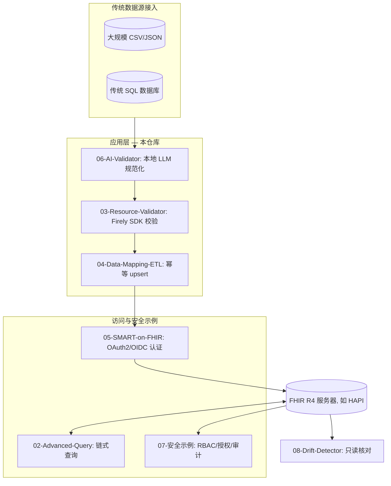

# HealthData Interoperability for .NET

**基于 Firely .NET SDK 的 HL7 FHIR R4 互操作参考实现 —— 一组可以直接阅读、运行和改用的可运行示例。**

[](https://dotnet.microsoft.com/)
[](https://hl7.org/fhir/R4/)
[](https://www.nuget.org/packages/HealthData.Interop.Fhir/1.3.5)
[](./src/tests/)
[](./LICENSE)

[🌐 **文档与 API 参考：访问 GitHub Pages**](https://memoryfraction.github.io/HealthData-Interoperability-Csharp)

---

## 📌 这是什么项目（以及不是什么）

**是什么：** 一个面向 HL7 FHIR R4 互操作的**应用层工具包和参考实现**。它构建在 [Firely .NET SDK](https://github.com/FirelyTeam/firely-net-sdk)（[Hl7.Fhir.R4](https://www.nuget.org/packages/Hl7.Fhir.R4/) 客户端/模型 + [Firely.Fhir.Validation.R4](https://www.nuget.org/packages/Firely.Fhir.Validation.R4/) 资源校验）之上，提供一组小而可测试的服务：患者 CRUD、链式搜索、FHIR 资源校验、CSV→FHIR ETL、SMART on FHIR 认证、本地 LLM 数据规范化、HIPAA 安全规则取向的安全示例（RBAC、授权、审计、PHI 脱敏），以及数据漂移检测。

**不是什么：** 它不替代 FHIR 服务器，不是完整的 EHR，也不是 FHIR 服务器"引擎"或中间件平台。它本身不提供经认证的 HIPAA 或 ONC 合规。请把它当作一组模式与起点，而不是开箱即用或经过认证的产品。

**中文说明：** 本项目基于美国医疗标准（US Core / SMART on FHIR / HIPAA）构建，但核心模式和代码可以迁移至中国市场 —— 中国正在推进 FHIR China IG 标准化进程。

**稳定性：** 当前版本 **v1.3.5**。项目处于**早期阶段**，公开 API 在 minor 版本之间仍可能变化。建议仅在非关键或概念验证（PoC）场景中使用 `HealthData.Interop.Fhir`，直到 2.x 稳定线。

### 架构概览



---

## 📌 本项目演示什么

一组可运行的互操作模式示例，涉及 **US Core** 与 **SMART on FHIR**，以及基于 Firely .NET SDK 的日常 FHIR 集成模式：

| 模块 | 演示内容 | 关键 API |
| :--- | :--- | :--- |
| **[01 Basic FHIR Client](./src/1-Basic-Client)** | 在 FHIR R4 服务器上创建患者 + 按姓名搜索 | `FhirBasicService` |
| **[02 Advanced Query](./src/02-Advanced-Query)** | 链式参数搜索；`_include`/`_revinclude` 一次查询取回关联资源 | `AdvancedQueryService` |
| **[03 FHIR Resource Validation](./src/03-Resource-Validator)** | Firely SDK 按 FHIR R4 规范校验；US Core profile 声明检查 | `ResourceValidationService`、`UsCoreConformanceChecker` |
| **[04 Data Mapping / ETL](./src/04-Data-Mapping-ETL)** | CSV→FHIR 映射 + 幂等 upsert（先查后 Conditional PUT、事务 Bundle） | `EtlPipelineService`、`FhirPatientMapper` |
| **[05 SMART on FHIR](./src/05-SMART-on-FHIR)** | OAuth2/OIDC client-credentials 流程 + 令牌缓存；SMART ETL 导入 | `SmartOnFhirAuthService`、`SmartFhirEtlService` |
| **[06 AI-Assisted Data Mapping](./src/06-AI-Data-Validator)** | 本地 LLM（Ollama）规范化"噪声"记录 + 确定性护栏 | `AiValidatorService`、`ClinicalGuardrails` |
| **[07 HIPAA Technical Safeguards Demo](./src/07-HIPAA-Technical-Safeguards-Demo)** | RBAC、授权校验、审计日志、PHI 脱敏 —— HIPAA 安全规则取向的示例 | `HipaaComplianceOrchestrator`、`RbacAuth`、`ConsentManager`、`AuditLog` |
| **[08 Data Drift Detector](./src/08-Data-Drift-Detector)** | 传统源与已同步 FHIR 副本之间的只读核对 | `DriftDetectionService` |

所有共享逻辑都在 [`src/HealthDataInteropSharedLibrary`](./src/HealthDataInteropSharedLibrary)（以 `HealthData.Interop.Fhir` NuGet 包发布）；每个编号目录都是一个演示不同场景的小型控制台应用。

---

## 📂 示例

### 01 — Basic FHIR Client

在 FHIR R4 服务器上创建 `Patient` 并按姓名搜索。

```bash
dotnet run --project src/1-Basic-Client
```

- 默认指向公共演示服务器 `http://server.fire.ly`；修改 `Program.cs` 中的 URL 指向你自己的服务器。
- 服务器不可达时，程序打印网络提示并优雅退出 —— 不会崩溃。

### 02 — Advanced Query

链式参数搜索：按医师姓名查找 `Encounter`，用 `_include`/`_revinclude` 让关联资源在一次查询中返回。

```bash
dotnet run --project src/02-Advanced-Query
```

### 03 — FHIR Resource Validation

使用 `Firely.Fhir.Validation.R4` 按 R4 规范校验 FHIR 资源。示例刻意构造了*无效* Patient（如 `BirthDate = "1990-13-45"`）以展示真实的诊断输出。

```bash
dotnet run --project src/03-Resource-Validator
```

- FHIR R4 规范（约 6MB）随包内置，离线也能做完整规范校验；规范不可用时自动降级为基本结构校验。
- US Core：`UsCoreConformanceChecker.CheckPatientConformance(patient)` 检查 `Patient` 的 `Meta.Profile` 是否声明了 US Core profile URI —— 这是 **profile 声明检查**，不是完整的 US Core IG 符合性测试，也不意味着 ONC 认证。

### 04 — Data Mapping / ETL (CSV → FHIR)

将 `Data/legacy_patients.csv` 映射为 FHIR `Patient` 并 upsert，**重跑任务时更新已有记录而不是重复创建**：

1. **提取** — 读取 CSV 行为类型化 `LegacyPatientRecord`（CsvHelper）。
2. **转换** — `FhirPatientMapper`（Mapperly 源码生成器）映射为 `Patient`，包含性别规范化（`male`/`female`/`f`/`m` → FHIR `AdministrativeGender`）。
3. **加载** — 先按业务标识搜索，再 Conditional PUT（ETag）更新或创建；结果打包进 `BundleType.Transaction` 保证原子性。

```bash
dotnet run --project src/04-Data-Mapping-ETL
```

### 05 — SMART on FHIR

两部分：

- **`SmartOnFhirAuthService`**（共享库）— OAuth2/OIDC **client-credentials** 流程，带令牌缓存与刷新，`CreateAuthenticatedFhirClientAsync(url)` 直接返回可用的已认证 `FhirClient`。
- **`SmartFhirEtlService`** — SMART 风格 ETL 导入，每次运行使用独立 identifier system，避免公共测试服务器上的标识符冲突。

```bash
dotnet run --project src/05-SMART-on-FHIR
```

- 演示 SMART on FHIR 中的作用域访问模式（如 `openid profile patient/*.read`）。

### 06 — AI-Assisted Data Mapping（本地 LLM）

用**本地 LLM（Ollama，`llama3`）**把"噪声"记录（如 `"Mmale, Jhon Doe, 1990-13-45"`）规范化为 FHIR 就绪的 `Patient` —— **为本地推理而设计，不向云端 LLM 发送数据**。流程刻意分两步：

1. **LLM 环节** — 模型把原始行映射为小型 JSON DTO（`PatientDto`）。
2. **确定性护栏** — `ClinicalGuardrails.Validate(dto)` 拒绝逻辑上无效的输出（如未来出生日期、不可解析的日期）。无效行被报告为拒绝，而不是静默写入。

```bash
dotnet run --project src/06-AI-Data-Validator
```

- 需要本地运行 [Ollama](https://ollama.com/) 并拉取 `llama3`（`ollama pull llama3`）。
- LLM 输出非确定性：护栏能降低但不能保证正确性。
- AI provider 以普通 `Func<string, Task<string>>` 注入，可替换为任何本地模型端点。

### 07 — HIPAA Technical Safeguards Demo

> ⚠️ **这是一个技术保障演示，不是合规产品。** 它展示 HIPAA 安全规则风格的控制如何在代码中实现。实际合规取决于你的部署、运营和组织上下文 —— 本仓库不认证、不保证 HIPAA 合规。

把一次模拟的 PHI 访问请求走完整流程：**RBAC 检查 → 患者授权校验（使用目的）→ 审计日志**，控制台输出全部经过 PHI 脱敏（`SafeConsole` / `PhiMasker`）。

```bash
dotnet run --project src/07-HIPAA-Technical-Safeguards-Demo
```

关键 API：`HipaaComplianceOrchestrator.ExecutePhiAccessRequest(...)`、`RbacAuth.CanAccessFullPHI(role)`、`ConsentManager.CheckConsent(patientId, purpose)`、`AuditLog.Record(...)`、`PhiEncryptionService`（AES-256-GCM）。

#### 本演示建模的安全控制（45 CFR §164.312 风格）

| 控制项 | HIPAA 安全规则（45 CFR） | 代码位置 | 状态 |
| :------ | :---------------- | :-------------- | :----- |
| 访问控制 | §164.312(a)(1) | `RbacAuth` — 8 角色矩阵，默认最小权限 | 代码中演示 |
| 身份鉴别 | §164.312(a)(2)(iii) | `SmartOnFhirAuthService` — OAuth2/OIDC client-credentials | 代码中演示 |
| 静态加密 | §164.312(a)(2)(iv) | `PhiEncryptionService` — AES-256-GCM | 代码中演示 |
| 审计控制 | §164.312(b) | `AuditLog` — UTC 时间戳 JSON 条目 | 代码中演示 |
| 完整性控制 | §164.312(c)(1) | `ResourceValidationService` + ETL 路径中的 Conditional PUT（ETag） | 代码中演示 |
| 传输安全 | §164.312(e)(1) | 强制 TLS 1.2+；默认严格证书校验（见安全声明） | 配置强制 |
| 授权管理 | §164.508 | `ConsentManager` — 使用目的检查 | 代码中演示 |

### 08 — Data Drift Detector

面向混合架构的只读核对：逐字段（姓名、性别、出生日期、电话）比较传统源（CSV）与 FHIR 服务器上实际存储的内容。每条记录得到三种显式结果之一：

- **同步**
- **字段级漂移** — 展示旧值 vs 新值
- **服务器上缺失** — 从未同步，或被删除

只检测不写入：模块 08 从不写 FHIR 副本；对账是单独、刻意的步骤（重跑模块 04 或手动修复）。

```bash
dotnet run --project src/08-Data-Drift-Detector
```

- 默认指向 `https://hapi.fhir.org/baseR4`；修改 `Program.cs` 指向你自己的服务器。

---

## 🛠 如何运行

**前置条件**

- **.NET 10 SDK** — `global.json` 固定 `10.0.302`；如需其他 10.0.x SDK 请调整 `rollForward`。示例应用目标 `net10.0`；共享库目标 `net8.0`（可在 .NET 8/9/10 应用中引用）。
- **网络访问** — 模块 01/02/04/05/08 会访问公共 FHIR 测试服务器。
- **[Ollama](https://ollama.com/) + `llama3`**（模块 06）。
- （可选）一个支持 client-credentials 的 OIDC provider，用于真实走一遍模块 05 的认证流程。

**运行模块**

```bash
git clone https://github.com/memoryfraction/HealthData-Interoperability-Csharp.git
cd HealthData-Interoperability-Csharp

dotnet run --project src/1-Basic-Client
dotnet run --project src/02-Advanced-Query
dotnet run --project src/03-Resource-Validator
dotnet run --project src/04-Data-Mapping-ETL
dotnet run --project src/05-SMART-on-FHIR
dotnet run --project src/06-AI-Data-Validator
dotnet run --project src/07-HIPAA-Technical-Safeguards-Demo
dotnet run --project src/08-Data-Drift-Detector
```

**运行测试**

```bash
dotnet test
```

180 个单元测试（MSTest v3 + FluentAssertions）覆盖共享库服务 —— RBAC 矩阵、授权检查、审计日志结构、PHI 加密往返、性别规范化、US Core 检查、SMART 认证选项校验、漂移比较、FHIR 患者映射器。

---

## ⚠️ 局限性

- **早期阶段。** 公开 API 在 minor 版本之间仍可能变化。在 2.x 稳定线之前，请仅用于非关键或 PoC 场景。
- **未经生产认证。** 本仓库不包含经认证的 HIPAA 方案、ONC 认证产品，或完整的 US Core 符合性实现。
- **没有性能基准。** 仓库中没有可复现的时延/分配基准，也不主张任何性能数字。
- **公共测试服务器。** 模块 01/02/04/05/08 默认指向公共 FHIR 测试服务器（`server.fire.ly`、`hapi.fhir.org`），可能会在那里创建记录。运行前请检查各 `Program.cs` 中的 URL，切勿不加检查地指向生产数据。
- **本地 AI 模块（06）。** 输出质量取决于本地模型；护栏会拒绝明显无效的结果，但不能保证临床正确性。
- **范围。** 这些是针对特定场景（以 Patient 为中心）的参考示例，不是通用 FHIR 框架。

---

## 📦 依赖

| 包 | 版本 | 用途 |
| :--- | :--- | :--- |
| [Hl7.Fhir.R4](https://www.nuget.org/packages/Hl7.Fhir.R4/) | 6.0.2 | FHIR R4 客户端与资源模型（Firely .NET SDK） |
| [Firely.Fhir.Validation.R4](https://www.nuget.org/packages/Firely.Fhir.Validation.R4/) | 3.1.0 | FHIR R4 资源校验 |
| [CsvHelper](https://www.nuget.org/packages/CsvHelper/) | 33.1.0 | ETL / 漂移模块中的 CSV 读取 |
| [Riok.Mapperly](https://www.nuget.org/packages/Riok.Mapperly/) | 4.1.1 | 编译时映射（CSV → FHIR） |
| [IdentityModel](https://www.nuget.org/packages/IdentityModel/) | 7.0.0 | OAuth2/OIDC client-credentials（SMART on FHIR） |
| [Polly](https://www.nuget.org/packages/Polly/) | 8.4.2 | 弹性原语 |
| [Serilog](https://www.nuget.org/packages/Serilog/) | 4.3.0 | 结构化日志 |
| [Microsoft.Extensions.Configuration.Json](https://www.nuget.org/packages/Microsoft.Extensions.Configuration.Json/) | 10.0.2 | 模块 05 的 `appsettings.json` 配置 |
| Ollama + `llama3` | — | 模块 06 的本地 LLM（可选） |

测试栈：MSTest 3.8.3、FluentAssertions 8.5.0。

---

## 🔐 安全声明

- **TLS 证书校验默认严格。** 仅存在一个本地开发用的校验绕过（如自签名 MITM 代理场景），**默认关闭** —— 只有显式设置环境变量 `HEALTHDATA_INSECURE_SKIP_TLS=1` 才会生效。切勿在生产环境设置；禁用 TLS 校验与 HIPAA §164.312(e)(1) 传输安全要求冲突。
- **PHI 脱敏日志。** 控制台/日志输出经过 `PhiMasker`：SSN、患者姓名、出生日期、电话、邮箱在到达控制台或日志 sink 前被替换为占位符。
- **本地 AI（模块 06）** 为本地推理而设计，不向云端 LLM 发送数据。"本地"降低了暴露面，但不是保证 —— 处理真实 PHI 前请自行评估威胁模型。

---

## 📦 NuGet 包

**包 ID:** `HealthData.Interop.Fhir` · **许可证:** MIT · **目标:** .NET 8.0（可用于 .NET 9/10+）

```bash
dotnet add package HealthData.Interop.Fhir
```

快速开始（与当前公开 API 核对过）：

```csharp
using HealthDataInteropSharedLibrary.BasicClient;
using HealthDataInteropSharedLibrary.ResourceValidator;

// 1. 指向一个 FHIR R4 服务器，按姓名搜索患者。
var service = new FhirBasicService("https://your-fhir-server.com/fhir");
var patients = await service.SearchPatientsByNameAsync("Doe");

foreach (var p in patients)
    Console.WriteLine(FhirBasicService.FormatPatientName(p));

// 2. 按内置 FHIR R4 规范校验一个 Patient 资源。
var validator = new ResourceValidationService();
if (patients.Count > 0)
{
    var ok = validator.Validate(patients[0]);
    Console.WriteLine(ok ? "Patient 符合 FHIR R4。" : "校验发现问题。");
}
```

---

## 🌏 中美医疗数据标准对照（开发者参考）

本项目基于美国标准构建，但核心模式可迁移至中国市场：

| 维度 | 🇺🇸 美国体系 | 🇨🇳 中国体系 |
|------|-------------|-------------|
| **互操作标准** | HL7 FHIR R4/R5（主导） | HL7 FHIR（推进中）、WS/T 系列规范 |
| **安全合规** | HIPAA Privacy & Security Rules | 《个人信息保护法》PIPL、等保2.0三级 |
| **编码体系** | ICD-10-CM, SNOMED CT, LOINC | ICD-10/11, 国家临床版3.0 |
| **互操作认证** | US Core IG / SMART on FHIR | 互联互通成熟度测评（四甲） |

> 中国市场适用场景：本仓库中的 ETL 管道、AI 数据规范化、资源校验等模式可复用于 FHIR China IG 项目；安全示例需按 PIPL/等保2.0 重新适配。

---

## 🔗 相关项目 / Related projects

| 项目 | 简介 |
|------|------|
| [Clinic FHIR Server](https://clinic-fhir-server-app.blackdesert-8e20099d.eastasia.azurecontainerapps.io/) | 面向诊所与社区健康中心的多租户 FHIR R4 服务器：租户隔离存储、RBAC、审计日志、PHI 加密。 |
| [XBridge](https://fhir-converter.greengrass-8e23c1df.westus.azurecontainerapps.io/) | 事前授权（Prior Authorization）工具包：按 payer Companion Guide 规则校验 X12 278 交易，并在 X12 与 FHIR R4 之间转换，完全在浏览器本地运行。 |
| [Quant.Infra.Net](https://github.com/memoryfraction/Quant.Infra.Net) | 一站式 .NET 量化交易基础设施 —— 多源数据接入、统一券商执行、组合分析。 |
| [LLSDA](https://github.com/memoryfraction/LLSDA-Lightning-Location-System-Data-Analyzer) | 开源闪电定位系统（LLS）数据分析类库 —— 已发布 NuGet 包，并被 TechRxiv 预印本引用。 |

> 同一作者的更多项目：[github.com/memoryfraction](https://github.com/memoryfraction)

---

## 👤 联系

**Rong (Rex) Fan** — .NET/C# · 医疗数据互操作（FHIR/HL7）· AI 工程

- **LinkedIn**: [Rong Fan](https://www.linkedin.com/in/rexfan18/)
- **GitHub**: [memoryfraction](https://github.com/memoryfraction)

---

## ⚖️ License

[MIT](./LICENSE) — 本仓库定位为参考实现与教育资源。你可以自由阅读、复制和改写代码；完整条款见 LICENSE 文件。不提供任何形式的保证。

> **免责声明**：本项目按"现状"提供，不提供任何形式的质保或维护承诺。使用者需自行评估其生产环境的适用性并独立承担相关风险。作者不对因使用本代码而导致的任何直接或间接损失负责。